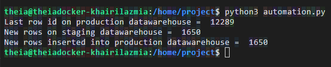

# Ecommerce Synchronized Data beetween Staging and Data Warehouse

## Sceanrio
I am a data engineer at an e-commerce company. I need to keep data synchronized between different databases/data warehouses as a part of my daily routine. One task that is routinely performed is the sync up of staging data warehouse and production data warehouse. Automating this sync up will save a lot of time and standardize process. I will create Python code to perform the incremental data load from MySQL server which acts as a staging warehouse to the PostgreSQL which is a production data warehouse. This script will be scheduled by the data engineers to sync up the data between the staging and production data warehouse.

## Objectives
In this assignment I will write a python program that will:

- Connect to PostgreSQL data warehouse and identify the last row on it.
- Connect to MySQL staging data warehouse and find all rows later than the last row on the datawarehouse.
- Insert the new data in the MySQL staging data warehouse into the PostgreSQL production data warehouse.

## Synchronize Log

